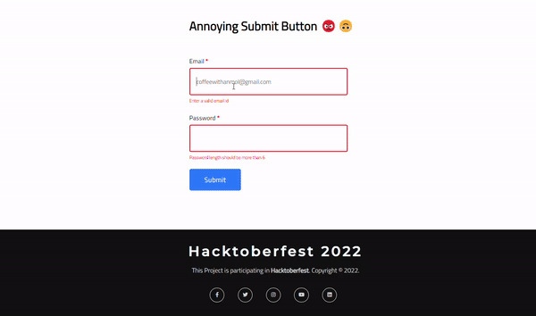

# Annoying Submit Button in a Form using ReactJS

</div>
<div align="center" >

<p>

<a href="https://github.com/fineanmol/Annoying-submit-button/graphs/Stars" alt="Stars">
        </a>
        
<a href="https://github.com/fineanmol/Annoying-submit-button/graphs/issues" alt="Contributors">
        </a>
<a href="https://github.com/fineanmol/Annoying-submit-button/graphs/contributors" alt="Contributors">
        </a>

<a href="https://github.com/fineanmol/Annoying-submit-button/forks">
      
    </a> 
    <a href="https://github.com/fineanmol/Annoying-submit-button/license">
      
    </a>
    <a href="https://github.com/fineanmol/Annoying-submit-button">
      
    </a>

</p>
</div>


You won't be able to submit the form until you enter correct length of password and an valid email ID.  Enjoy playing with it. :)
#Hacktoberfest

## Project Preview



## :bulb: Live Project Link
[Click here to play with **Annoying Submit Button**](https://annoyingsubmitbutton.netlify.app/)

---

## :writing_hand: Authors

👤 **Anmol Agarwal**

[](https://github.com/fineanmol)
[](https://linkedin.com/in/fineanmol)
[](https://twitter.com/fineanmol)


---

## :people_hugging: Show your support

Give a ⭐️ if you like this project and want to support it!

---


## 🛠️ Installation Steps

Star and Fork the Repo 🌟 and this will keep us motivated.

1. Clone the repository

```bash
git clone https://github.com/fineanmol/Annoying-submit-button
```

2. Change the working directory

```bash
cd Annoying-submit-button
```

3. Install dependencies

```bash
npm install
```

4. Run the app

```bash
npm start
```


---

## 🤝 Contributing

Contributions are what make the open source community such an amazing place to learn, inspire, and create. Any contributions you make are **greatly appreciated**.

If you have a suggestion that would make this better, please fork the repo and create a pull request. You can also simply open an issue with the tag "enhancement".
Don't forget to give the project a star! Thanks again!

1. Fork the Project
2. Create your Feature Branch (`git checkout -b 'feature/AmazingFeature'`)
3. Commit your Changes (`git commit -m 'Add some AmazingFeature'`)
4. Push to the Branch (`git push origin feature/AmazingFeature`)
5. Open a Pull Request

Feel free to check the [issues page](../../issues/).
---
## 📝 License

This project is under the [MIT](./LICENSE) license.

---

## Acknowledgments

- Hat tip to anyone whose code was used
- Inspiration
- etc
---
## :pray: Thanks

Thanks to everyone who has contributed towards this project

<div>
    <a href="https://github.com/fineanmol/Annoying-submit-button/graphs/contributors">
    
    </a>
</div>

---


